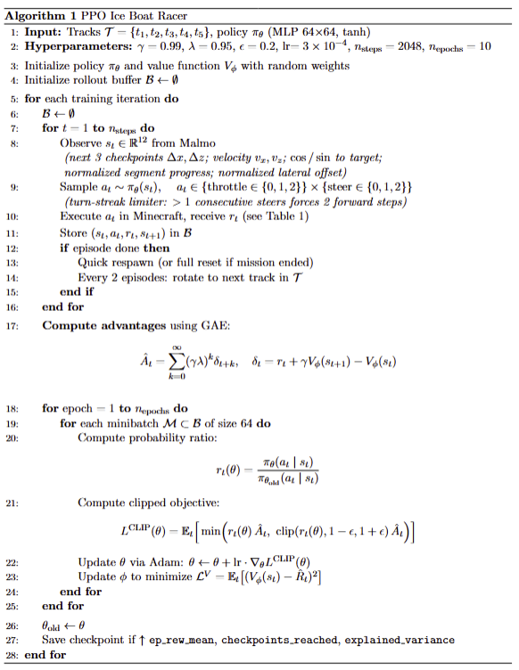
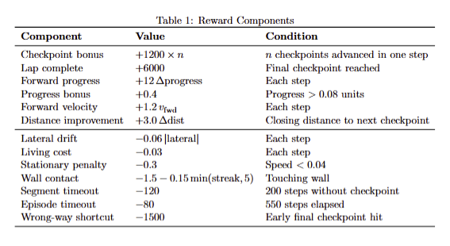
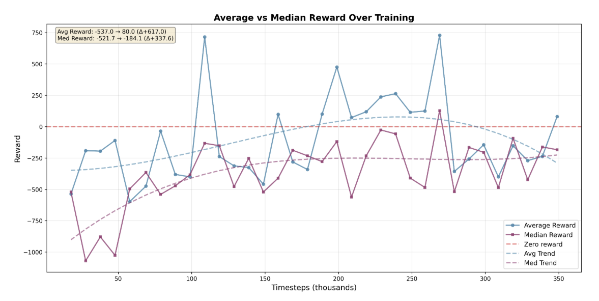
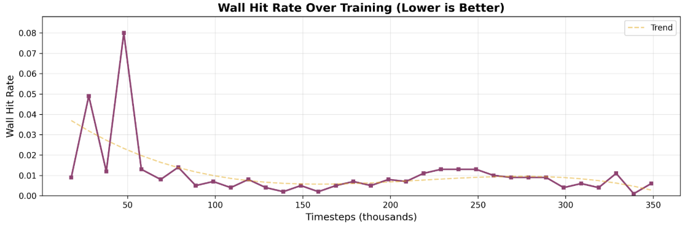

# Video:
https://youtu.be/XwhWx3wz9TM

# Final Model Repo:
https://github.com/billhan5732/CS175_Project/tree/tian_agent_testing

# Project Summary:
## Motivation
Minecraft’s boat physics, especially on ice, are notoriously finicky and sensitive thanks in part to balancing the extreme speeds this mode of transport is able to reach. Effectively moving and even racing for competition requires fine motor skills as well as technical knowledge of cornering strategies. This makes Boat Racing something fun and visualizable that an RL Agent would be perfectly adept for.

## Track Parameters and Generation
To make this project more engaging, we wanted our tracks to generate as closed loops with varying turn angles like real race tracks. As such the crux of our approach to generation is starting with a star shaped polygon and procedurally connecting bridges to fill cavities or cut off some of the star’s spikes. We were also hoping our agent could learn to perform checkpoint skips within the star shape where it could jump over the concave sections or even take a path of inner vertices (skipping the convex spines).
## Approach 
The general workflow for this project was: we started this project by standardizing our action and observation spaces. We thought PPO would be a suitable approach due to the fact that our space was continuous rather than discrete, and how Q-Learning would likely fall for immediate rewards rather than strive for completing a checkpoint. After deciding on PPO, we analyzed an initial PPO model and identified key problem areas. We then worked on our own iterations of the base model to address our assigned issues before sharing results and working on the final model.

Below is the final description and pseudocode of our most successful agent:

## Action Space:
The action space is MultiDiscrete([3, 3]) — two independent discrete axes:

Throttle (3 values): 
 - 0 = no throttle
 - 1 = forward
 - 2 = backward  

Steering (3 values):
- 0 = straight
- 1 = left
- 2 = right

A turn-streak limiter is also applied: if the agent steers in the same direction for more than 1 consecutive step, the action is overridden to force forward movement for 2 steps before steering resumes.

## Observation Space
The observation space is a 12-dimensional continuous vector (Box(-inf, inf, shape=(12,), dtype=float32)):
- dx1, dz1 — X/Z distance to the next (immediate) checkpoint 
- dx2, dz2 — X/Z distance to the checkpoint after that 
- dx3, dz3 — X/Z distance to the checkpoint two ahead 
- vx, vz — Agent velocity in X and Z directions 
- cos_angle_to_target — Cosine of the relative angle from the agent's heading to the next checkpoint 
- sin_angle_to_target — Sine of the same relative angle 
- normalized_progress_to_segment_end — How far along the current segment the agent is, normalized by segment length 
- normalized_lateral_offset — Lateral (sideways) displacement from the segment centerline, normalized by segment length

## Optimization Function

## Evaluation
To evaluate our model, we tracked the mean episode length as well as the mean rewards/episode. For models with borders, the length of the episode is essentially the completion time and wall hit rate represents how efficient the agent has gotten at traversal.

The above figure generally shows how the agent optimizes for rewards. Unfortunately it seems to have plateaued. 
From our qualitative analysis, we generally see that the model has few extremely good runs occasionally. These are averaged out by the less successful but more common runs.

This figure shows how notably the agent has learnt to avoid touching walls. 
While analyzing our agent, we generally use qualitative observations as seen in the videos.
During the development of this project, not much quantitative data was tracked.
The above charts were generated by simulating multiple runs with each timestep save of the final model (saved while training).

## Resources Used:
### Python Libraries:
Malmo:  
- Much like other CS 175 projects, we were fortunate enough that Microsoft has their own proprietary Minecraft AI library, Project Malmo. However, this library has not been updated since 2018.
- https://github.com/microsoft/malmo/releases 
- https://microsoft.github.io/malmo/0.30.0/Documentation/index.html

Gym:
- Gym provided the standardized RL environment and API we could use with the other libraries. Specifically because of Malmo's age, finding compatible libraries was difficult. (Python 3.6-3.9)

Stablebaselines3:
- Source of the PPO and SAC models
- Provides pre-built, tested RL algorithms (PPO, SAC, A2C, DQN, TD3, etc.)
- Handles all the complex RL training infrastructure for us

### Papers referenced:

#### PPO — Schulman et al. 2017
Schulman, J., Wolski, F., Dhariwal, P., Radford, A., & Klimov, O. (2017). Proximal Policy Optimization Algorithms. arXiv preprint arXiv:1707.06347.
#### Malmo — Johnson et al. 2016
Johnson, M., Hofmann, K., Hutton, T., & Bignell, D. (2016). The Malmo Platform for Artificial Intelligence Experimentation. Proceedings of the 25th International Joint Conference on Artificial Intelligence (IJCAI), pp. 4246–4247.
#### Reward Shaping — Ng et al. 1999
Ng, A. Y., Harada, D., & Russell, S. (1999). Policy Invariance Under Reward Transformations: Theory and Application to Reward Shaping. Proceedings of the 16th International Conference on Machine Learning (ICML), pp. 278–287.
#### SB3 — Raffin et al. 2021
Raffin, A., Hill, A., Gleave, A., Kanervisto, A., Ernestus, M., & Dormann, N. (2021). Stable-Baselines3: Reliable Reinforcement Learning Implementations. Journal of Machine Learning Research, 22(268), 1–8.
### AI Tools:
Claude AI:
- Malmo installation assistance 
- Debugging assistance 
- Code sanitation and cleaning
- Result analysis
  - Graphing evaluation metrics for reports
- Correcting grammar and made report more readable
- As a search engine to find documentation pages

