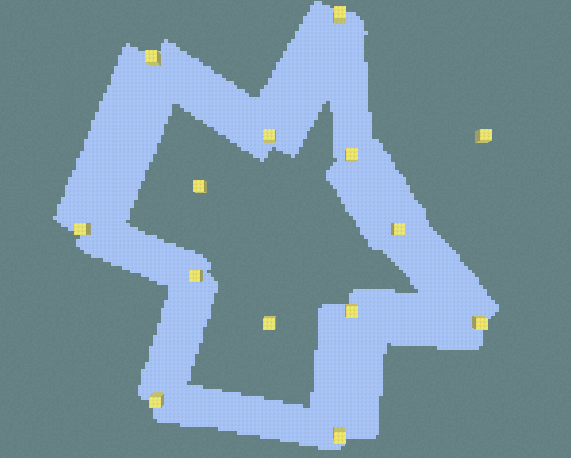

Source code: https://github.com/billhan5732/CS175_Project

## Project Overview

Boat racing is a common racing minigame in Minecraft. Each player a boat and must navigate the winding track and environment on ice via W A S D keys. Players will race for the fastest track time, and the fastest times are listed ascending on the leaderboard. Our project will train an AI agent to play the game and explore the efficiencies of different RL algorithms by comparing the times of each. These comparisons will help us distinguish what skill level the AI agent is most similar to, and thus its level of success in boat racing.

This project aims to use AI/ML to control a boat in minecraft boat racing.
This requires a lot of human precision and acute motor skills which makes it great for an RL AI agent.

Reports:

- [Proposal](proposal.html)
- [Status](status.html)
- [Final](final.html)

[quickref]: https://github.com/mundimark/quickrefs/blob/master/HTML.md
